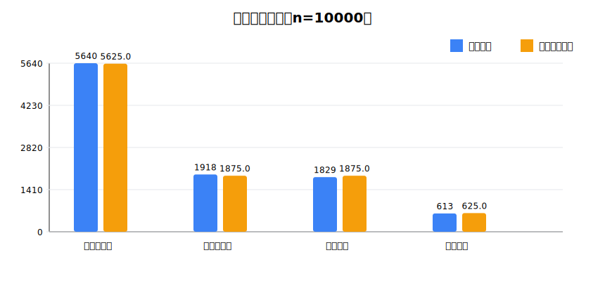

# 性状分离模拟器实践报告

6 位学号：__________  
姓名：__________

实践活动：设计或制作性状分离模拟器  
所选层级：L2：设计并制作

## 一、题目与研究问题

原题中，杂交水稻申优 28 的一对等位基因为 `W/w`：

- `W`：直链淀粉含量正常，表现为非糯性，显性。
- `w`：直链淀粉含量低，表现为糯性，隐性。
- 亲本基因型为 `Ww`。

在本次扩展模拟中，增加一对控制粒形的等位基因 `Y/y`：

- `Y`：长粒，显性。
- `y`：短粒，隐性。

因此模拟的亲本基因型为：

```text
P: WwYy x WwYy
```

需要研究的问题是：两个杂合亲本自交后，后代会出现哪些性状组合，各性状组合的理论比例和模拟结果分别是多少。

## 二、理论预测结果

亲本 `WwYy` 形成配子时，两对等位基因独立分离、自由组合，可形成 4 种配子：

| 配子类型 | 理论比例 |
| --- | ---: |
| WY | 1/4 |
| Wy | 1/4 |
| wY | 1/4 |
| wy | 1/4 |

用棋盘格表示 `WwYy x WwYy` 的 16 种等概率组合：

| 配子 | WY | Wy | wY | wy |
| --- | --- | --- | --- | --- |
| WY | WWYY | WWYy | WwYY | WwYy |
| Wy | WWYy | WWyy | WwYy | Wwyy |
| wY | WwYY | WwYy | wwYY | wwYy |
| wy | WwYy | Wwyy | wwYy | wwyy |

根据显隐性关系：

- `W_` 表现为非糯性，`ww` 表现为糯性。
- `Y_` 表现为长粒，`yy` 表现为短粒。

理论性状组合结果为：

| 性状组合 | 对应基因型 | 理论份数 | 理论比例 |
| --- | --- | ---: | ---: |
| 非糯性长粒 | `W_Y_` | 9 | 9/16 = 56.25% |
| 非糯性短粒 | `W_yy` | 3 | 3/16 = 18.75% |
| 糯性长粒 | `wwY_` | 3 | 3/16 = 18.75% |
| 糯性短粒 | `wwyy` | 1 | 1/16 = 6.25% |

因此理论比例为：

```text
非糯性长粒 : 非糯性短粒 : 糯性长粒 : 糯性短粒 = 9 : 3 : 3 : 1
```

如果只观察糯性，不区分粒形，则：

```text
非糯性 : 糯性 = (9 + 3) : (3 + 1) = 12 : 4 = 3 : 1
```

## 三、模拟器的设计说明

本模拟器采用 Python 程序实现，文件为 [segregation_simulator.ipynb](segregation_simulator.ipynb)。

### 1. 模拟器各组成部分含义

| 程序元素 | 代表含义 |
| --- | --- |
| `PARENT_GENOTYPE = "WwYy"` | 亲本基因型 |
| `["WY", "Wy", "wY", "wy"]` | 亲本可能产生的 4 种配子 |
| 随机抽取 1 个配子 | 模拟减数分裂产生配子 |
| 两个配子结合 | 模拟随机受精 |
| 后代基因型判断 | 根据两个配子组合得到 `WWYY`、`WwYy`、`wwyy` 等基因型 |
| 性状判断 | 根据 `W/w` 判断糯性，根据 `Y/y` 判断粒形 |
| 统计图和 CSV | 记录并汇总多次模拟实验结果 |

### 2. 核心逻辑

模拟器每次实验的步骤如下：

1. 亲本甲从 `WY`、`Wy`、`wY`、`wy` 中随机产生一个配子。
2. 亲本乙从 `WY`、`Wy`、`wY`、`wy` 中随机产生一个配子。
3. 两个配子结合形成后代基因型。
4. 若后代含有 `W`，表现为非糯性；若为 `ww`，表现为糯性。
5. 若后代含有 `Y`，表现为长粒；若为 `yy`，表现为短粒。
6. 记录实验序号、两个亲本配子、后代基因型、胚乳性状、粒形和性状组合。
7. 重复多次实验后，统计四种性状组合的数量和比例。

核心代码思想如下：

```python
def make_random_gamete():
    return random.choice(["WY", "Wy", "wY", "wy"])

def make_offspring_from_gametes(gamete1, gamete2):
    # 根据两个配子组合得到后代基因型
    # 根据 W/w 判断糯性，根据 Y/y 判断粒形
    # 返回后代基因型和性状组合
    ...
```

本模拟器还支持人工指定两个亲本配子，例如指定 `WY` 和 `wy`，程序会直接判断该次受精得到的后代基因型为 `WwYy`，性状组合为非糯性长粒。

## 四、模拟器的使用说明

1. 打开 [segregation_simulator.ipynb](segregation_simulator.ipynb)。
2. 运行第一个代码单元，加载模拟器函数。
3. 若进行随机连续实验，修改并运行：

```python
records = run_and_show(n=100, seed=100)
```

其中 `n` 表示实验次数，`seed` 用于固定随机结果，方便重复实验。

4. 若人工指定两个亲本配子，可运行：

```python
manual_result = make_offspring_from_gametes(gamete1="WY", gamete2="wy")
show_table([manual_result])
```

5. 实验结束后，运行保存单元：

```python
saved_files = save_experiment_files(records)
saved_files
```

程序会自动保存：

- 性状组合统计图片：`outputs/trait_combination_stats_n实验次数.svg`
- 实验结果 CSV：`outputs/experiment_results_n实验次数.csv`
- 性状组合汇总 CSV：`outputs/phenotype_summary_n实验次数.csv`

例如实验次数为 10000 时，文件名中会自动包含 `n10000`，不会覆盖其他实验次数的结果。

## 五、实验记录表

本次共保存了 100 次、1000 次和 10000 次模拟实验结果。

完整实验记录见：

- [100 次实验记录 CSV](outputs/experiment_results_n100.csv)
- [1000 次实验记录 CSV](outputs/experiment_results_n1000.csv)
- [10000 次实验记录 CSV](outputs/experiment_results_n10000.csv)

性状组合汇总表见：

- [100 次性状组合汇总 CSV](outputs/phenotype_summary_n100.csv)
- [1000 次性状组合汇总 CSV](outputs/phenotype_summary_n1000.csv)
- [10000 次性状组合汇总 CSV](outputs/phenotype_summary_n10000.csv)

10000 次实验统计图如下：



### 1. 实验记录表摘录

以下为 100 次实验记录中的前 7 次：

| 实验序号 | 亲本甲配子 | 亲本乙配子 | 后代基因型 | 胚乳性状 | 粒形 | 性状组合 |
| ---: | --- | --- | --- | --- | --- | --- |
| 1 | Wy | wY | WwYy | 非糯性 | 长粒 | 非糯性长粒 |
| 2 | wy | wY | wwYy | 糯性 | 长粒 | 糯性长粒 |
| 3 | WY | wy | WwYy | 非糯性 | 长粒 | 非糯性长粒 |
| 4 | WY | wY | WwYY | 非糯性 | 长粒 | 非糯性长粒 |
| 5 | wY | WY | WwYY | 非糯性 | 长粒 | 非糯性长粒 |
| 6 | Wy | wy | Wwyy | 非糯性 | 短粒 | 非糯性短粒 |
| 7 | Wy | wy | Wwyy | 非糯性 | 短粒 | 非糯性短粒 |

### 2. 不同实验次数的汇总结果

| 实验次数 | 非糯性长粒 | 非糯性短粒 | 糯性长粒 | 糯性短粒 |
| ---: | ---: | ---: | ---: | ---: |
| 100 | 57 | 28 | 11 | 4 |
| 1000 | 564 | 195 | 188 | 53 |
| 10000 | 5640 | 1918 | 1829 | 613 |

### 3. 10000 次实验结果与理论比例比较

| 性状组合 | 实际数量 | 实际比例 | 理论比例 |
| --- | ---: | ---: | ---: |
| 非糯性长粒 | 5640 | 56.40% | 56.25% |
| 非糯性短粒 | 1918 | 19.18% | 18.75% |
| 糯性长粒 | 1829 | 18.29% | 18.75% |
| 糯性短粒 | 613 | 6.13% | 6.25% |

## 六、分析与讨论

### 1. 理论结果分析

`WwYy` 亲本产生配子时，`W/w` 与 `Y/y` 两对等位基因分别分离，并且自由组合，所以可以形成 `WY`、`Wy`、`wY`、`wy` 四种配子，理论比例为 `1:1:1:1`。

两个 `WwYy` 亲本自交时，雌雄配子随机结合，共有 16 种等概率组合。由于 `W` 和 `Y` 均为显性，后代会出现四种性状组合：非糯性长粒、非糯性短粒、糯性长粒、糯性短粒，理论比例为 `9:3:3:1`。

### 2. 实际结果与理论结果比较

从 10000 次实验结果看：

- 非糯性长粒实际比例为 56.40%，理论比例为 56.25%。
- 非糯性短粒实际比例为 19.18%，理论比例为 18.75%。
- 糯性长粒实际比例为 18.29%，理论比例为 18.75%。
- 糯性短粒实际比例为 6.13%，理论比例为 6.25%。

实际结果与理论比例非常接近，说明模拟器能够较好地模拟两对等位基因自由组合和随机受精的过程。

### 3. 偏差原因分析

实际结果与理论结果并不完全相同，主要原因包括：

1. 随机误差：每次配子产生和受精都是随机事件，有限次数实验不一定刚好等于理论比例。
2. 样本量影响：100 次实验中偏差较明显；1000 次和 10000 次实验中，结果逐渐接近理论比例。
3. 理论比例是概率预测：`9:3:3:1` 是大量重复实验后的期望比例，不要求每一次小样本实验都完全符合。

### 4. 实验结论

本模拟器成功模拟了 `WwYy x WwYy` 自交过程。实验结果表明，在两对基因独立遗传的条件下，后代四种性状组合的理论比例为：

```text
非糯性长粒 : 非糯性短粒 : 糯性长粒 : 糯性短粒 = 9 : 3 : 3 : 1
```

随着模拟实验次数增加，实际统计结果越来越接近理论比例。这说明杂合子形成配子时等位基因会分离，不同对基因可以自由组合，受精时雌雄配子随机结合，从而产生符合孟德尔自由组合定律的性状分离现象。
